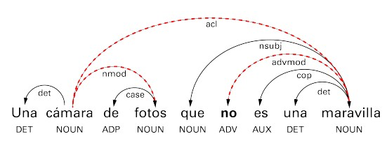

### Summary

The automatic detection of negation and the words they affect is an important task that could benefit other Natural Language Processing tasks such as Information Extraction, Sentiment Analysis, and Question Answering. In the present work, a solution to the negation problem is proposed based on supervised machine learning techniques. The essence is the detection of the negation signals and their scope, all of it in Spanish texts. The work is done in two phases: in the first one the signals are identified and in the second the whole scope of these cues is determined.

* In the first phase it is determined if a certain sentence is negated or not, identifying the words that determine the negation.
* These predictions are used in the second phase, where the scope of the negation is determined.
* First, the text is processed and lexical (tokens, part-of-speech tags and lemmas) and syntactic (dependency analysis) information is obtained from it.
* These data are converted for the input of the negation detector.
* After obtaining the prediction these are used for the determination of the scope of the negation.
* A Streamlit application is developed to test the results of the machine learning algorithm.
* The application is containerized using Docker.

### **Skills**

- NLTK
- Spacy
- Streamlit
- Natural Language Processing
- Logistic Regression
- Docker

### Resources

- [GitHub Link](https://github.com/lorainemg/negation-detection)
- [Paper](https://github.com/lorainemg/negation-detection/blob/main/docs/paper.pdf)
- [Corpus](http://clic.ub.edu/corpus/es/node/171)
 